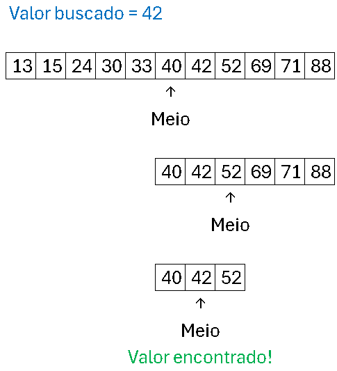

# Lista de Exercícios 06: Funções e Recursividade. 

Profº.: Cainã Antunes Silva  
Faculdade de Tecnologia **SENAI Sorocaba**  
Tecnólogo em Análise e Desenvolvimento de Sistemas (ADS)
___


> O objetivo desta aula é compreender o funcionamento de programação estruturada através da implementação de funções.

Funções são blocos de código reutilizáveis que recebem parâmetros, executam uma tarefa e podem retornar um valor, promovendo modularidade e organização nos programas. Já a recursividade ocorre quando uma função chama a si mesma, sendo uma técnica poderosa para resolver problemas complexos de forma mais intuitiva e reduzindo a necessidade de estruturas de repetição explícitas. Ela é especialmente útil para simplificar algoritmos que lidam com estruturas hierárquicas, como árvores e grafos, tornando o código mais legível e elegante. Ambas são essenciais para a eficiência e clareza do código, facilitando a manutenção e reutilização.

Para mais informações acesse [Aula 07: Funções e Recursividade.](https://cainaantunes.notion.site/Aula-07-Fun-es-189bde521b3b80a0bc46f7b3587189ef?pvs=4)

***

1. Escreva uma função que receba um número inteiro positivo $N$ e retorne a soma de todosos números inteiros de $1$ até $N$. Obs.: $N$ deve ser maior que $0$.

2. Implemente uma função para calcular o fatorial de um número inteiro $N$ digitado pelo usuário.

3. Crie uma função para calcular a potência de um número inteiro $x$ elevado a uma potência inteira $y$. Os valores de $x$ e $y$ serão fornecidos pelo usuário. $y$ deve ser maior ou igual a zero. <font color="red">Proibido utilizar ```Math.pow(x,y)```</font>.

4. Escreva uma função em Java para verificar se uma *String* é um palíndromo. A *String* deve ser digitada pelo usuário. Um palíndromo é uma palavra, frase ou sequência que se lê da mesma forma de trás para frente. 

    Exemplos: “ovo”, “tenet”, “abasedotetodesaba”.

5. <font color="red">**Desista! Sem GPT você não vai conseguir!**</font> Implemente uma função para realizar uma busca binária em um array ordenado de inteiros, retornando a posição do elemento buscado ou -1 se o elemento não for encontrado. 
    
    A busca binária é um algoritmo eficiente para encontrar um elemento em um vetor ordenado. Ele funciona dividindo repetidamente o vetor pela metade e determinando em qual metade o elemento buscado pode estar presente. 
    
    Veja a ilustração a seguir:

    

6. <font color="red">**Não há nada tão ruim que não possa piorar!**</font> Refaça todos os exercícios anteriores utilizando recursividade.